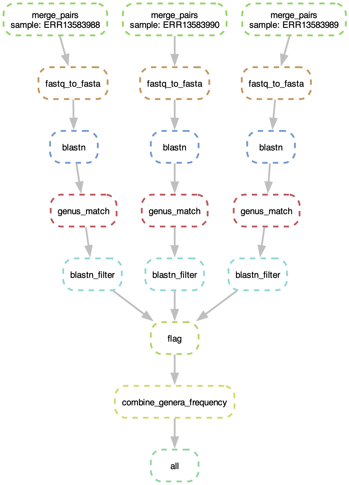

# 16SfastLAB

A reproducible, scalable pipeline for processing 16S rRNA gene sequencing data using Snakemake and Conda. This pipeline:
- Merges paired-end FASTQ files using VSEARCH.
- Converts merged FASTQ files into FASTA format.
- Runs BLASTn against a custom 16S database.
- Extracts genus-level information from BLAST output.
- Filters and summarizes BLAST results to generate relative abundance frequency tables.
- Combines frequency data across samples into a single report.


## Introduction

The **16SfastLAB** Pipeline is designed for bioinformatics users who need to process paired-end 16S rRNA sequencing data quickly and reproducibly. The pipeline performs multiple steps, including read merging, conversion to FASTA, BLASTn search, and downstream analysis using custom Python scripts, all coordinated by Snakemake. The use of Conda environments and a YAML configuration file guarantees that dependencies are isolated and reproducible.


## Installation

### Prerequisites

- **Conda/Mamba:** Ensure you have [Miniconda](https://docs.conda.io/en/latest/miniconda.html) installed. (Using [Mamba](https://mamba.readthedocs.io/en/latest/) for faster environment resolution is recommended.)
- **Git:** To clone the repository.
- **Graphviz:** (Optional) For generating DAG visualizations.

### Steps

1. **Clone the repository:**

```bash
git clone https://github.com/nanzhen102/16SfastLAB.git
cd 16SfastLAB
```

2.	**Configure Conda channels:**

Set strict channel priority for robust environments:

```bash
conda config --set channel_priority strict
```

3.	**Create Conda Environments:**

Your repository includes separate environment files inside the envs/ directory:

- envs/blast.yaml: For running BLASTn.
- envs/vsearch.yaml: For VSEARCH.
- envs/python_scripts.yaml: For Python scripts (e.g., genus extraction, filtering, and combining frequency data).

Snakemake will automatically create these environments when you run the pipeline using --use-conda.

## Usage

From the main project directory, execute the pipeline with:

```bash
snakemake --cores 4 --use-conda
```

This command will:

- Build and activate the required Conda environments.
- Process each sample from the data/ directory.
- Generate intermediate and final outputs in the results/ directory.
- Log the execution of each rule in the logs/ directory.


## Input

**Data Files**

- The pipeline expects paired-end FASTQ files to be stored in the data/ directory.
- File naming convention: `ERRxxxxxx_1.fastq.gz` and `ERRxxxxxx_2.fastq.gz`
- A configuration file `config.yaml` is used to specify directory paths, database locations, and tool parameters.

## Output

After running the pipeline, the results/ directory will contain:

- Merged FASTQ Files: e.g., `ERRxxxxxx_merged.fastq`
- FASTA Files: e.g., `ERRxxxxxx_merged.fasta`
- BLASTn Output Files: e.g., `ERRxxxxxx_blastn_ssu_r220_LAB.out`
- Genus Match Files: e.g., `ERRxxxxxx_genus_match.csv`
- Filtered Results: e.g., `ERRxxxxxx_filtered.csv`
- Frequency Tables: e.g., `ERRxxxxxx_frequency.csv`
- Combined Frequency Table: `combined_genera_frequency.csv`

Logs for each rule are stored in the logs/ directory.

## Options

- Conda Flag:
`--use-conda` must be specified when running Snakemake to use the Conda environment files.
- Cores:
`--cores <N>` specifies the number of cores to utilize.
- Config File:
The `config.yaml` file controls input/output paths and parameters. Modify this file to adjust database paths, tool parameters, or directory settings.

## Example Data

In the data/ directory (e.g., a pair of small FASTQ files named `ERR000001_1.fastq.gz` and `ERR000001_2.fastq.gz`).

## Workflow

