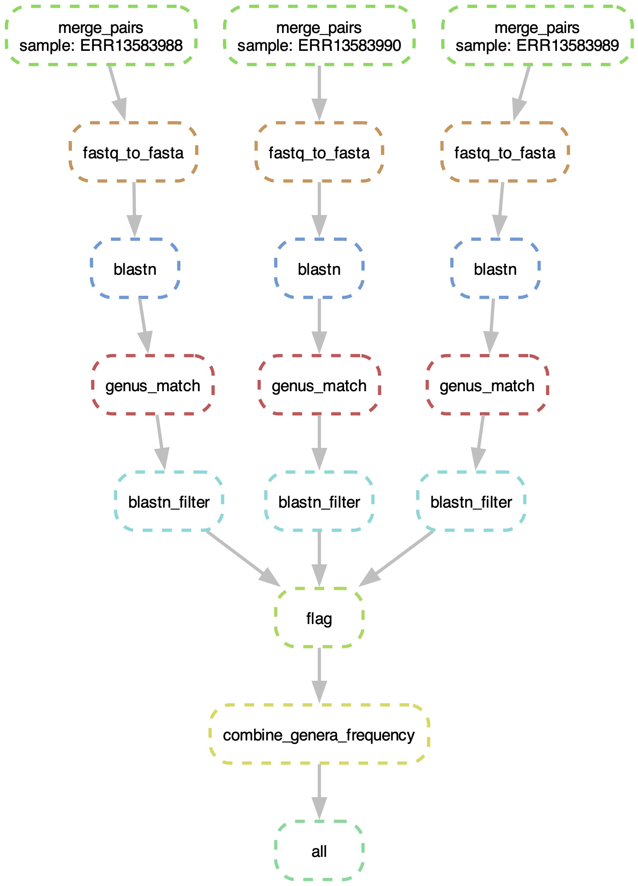

16SfastLAB is a reproducible and scalable pipeline for processing 16S rRNA gene amplicon sequencing data. It assigns taxonomic information at the genus level for the *Lactobacillaceae* family using Snakemake and Conda.

## Contents

- [Introduction](#introduction)
- [Workflow](#workflow)
- [Installation](#installation)
- [Usage](#usage)
- [Input](#input)
- [Output](#output)
- [Options](#options)
- [Dependencies](#dependencies)
- [Example Data](#example-data)
- [Tips 🐯](#tips-)

## Introduction

The **16SfastLAB** Pipeline is designed for bioinformatics users who need to quickly understand the presence of lactic acid bacteria in paired-end 16S rRNA sequencing data. This pipeline:

This pipeline:
- Merges paired-end FASTQ files using VSEARCH.
- Converts merged FASTQ files into FASTA format.
- Runs BLASTn against a custom 16S database.
- Extracts genus-level information from BLAST output.
- Filters and summarizes BLAST results to generate relative abundance frequency tables.
- Combines frequency data across samples into a single CSV, organized by the latest taxonomic order of *Lactobacillaceae*.

## Workflow



## Installation

### Prerequisites

- **Conda/Mamba:** Ensure you have [Miniconda](https://docs.conda.io/en/latest/miniconda.html) installed. (Using [Mamba](https://mamba.readthedocs.io/en/latest/) for faster environment resolution is recommended.)
- **Git:** To clone the repository.

### Steps

1. **Clone the repository:**

    ```bash
    git clone https://github.com/nanzhen102/16SfastLAB.git
    cd 16SfastLAB
    ```
2.	**Create Conda Environments:**

    Please install the following manually before running the pipeline:

    - vsearch (≥2.15)
    - blastn
    - Python 3 (≥3.8) with packages:
        - biopython
        - pandas
    ```bash
    conda install bioconda::vsearch # install vsearch (then blastn will be installed at the same time)
    mamba install -c conda-forge -c bioconda biopython # install biopython
    ```

## Usage

From the main project directory, execute the pipeline with:

```bash
snakemake --cores 8 
```

This command will:

- Build and activate the required Conda environments.
- Process each sample from the data/ directory.
- Generate intermediate and final outputs in the results/ directory.
- Log the execution of each rule in the logs/ directory.


## Input

**Data Files**

- The pipeline expects both **paired-end** and **single-end** FASTQ files to be stored in the `data/` directory.
- File naming convention: `ERRxxxxxx_1.fastq.gz` and `ERRxxxxxx_2.fastq.gz`, or `SRRxxxxxx_1.fastq.gz` and `SRRxxxxxx_2.fastq.gz`, or `ERRxxxxxx_1.fastq` and `ERRxxxxxx_2.fastq`, or `SRRxxxxxx_1.fastq` and `SRRxxxxxx_2.fastq`, or `ERRxxxxxx_trimmed.fastq`.
- A configuration file `config.yaml` is used to specify directory paths, database locations, and tool parameters.

## Output

After running the pipeline, the results/ directory will contain:

- Merged FASTQ Files: e.g., `xxxxxx_merged.fastq`
- FASTA Files: e.g., `xxxxxx_merged.fasta`
- BLASTn Output Files: e.g., `xxxxxx_blastn_ssu_r220_LAB.out`
- Genus Match Files: e.g., `xxxxxx_genus_match.csv`
- Filtered Results: e.g., `xxxxxx_filtered.csv`
- Frequency Tables: e.g., `xxxxxx_frequency.csv`
- Combined Frequency Table: `combined_genera_frequency.csv`

Logs for each rule are stored in the logs/ directory.

## Options

- Conda Flag:
`--use-conda` must be specified when running Snakemake to use the Conda environment files.
- Cores:
`--cores <N>` specifies the number of cores to utilize.
- Config File:
The `config.yaml` file controls input/output paths and parameters. Modify this file to adjust database paths, tool parameters, or directory settings.

## Dependencies
- Snakemake
- Conda/Mamba
- BLAST+
- VSEARCH

## Example Data

In the `data/` directory.

## Tips 🐯

To download SRR files from NCBI SRA database:
```bash
fasterq-dump SRR24916211 --split-files --gzip -O data/
```
Or
```bash
tail -n +2 SraAccList.csv | while read srr; do
  fasterq-dump "$srr" --split-files -O data/
done
```